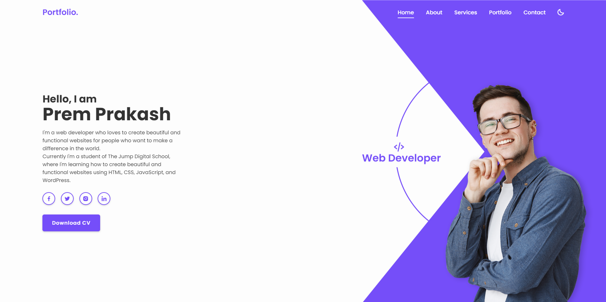

# Prem Prakash's Portfolio

Welcome to my portfolio website! I'm Prem Prakash, currently learning full-stack development and passionate about creating meaningful and innovative projects.

## Table of Contents
- [About Me](#about-me)
- [Projects](#projects)
- [Skills](#skills)
- [Contact](#contact)

## About Me
I am Prem Prakash, a dedicated learner in the field of full-stack development. My mission is to leverage technology to create solutions that make a positive impact. Join me on my journey of continuous learning and exploration.

## Projects
### [Project: Online Bookstore](#)
A full-stack web application for managing and purchasing books online. The project involves implementing user authentication, managing a product catalog, and handling online transactions.

### [Project: Personal Blog](#)
A blogging platform where users can create and share their thoughts and experiences. The project includes features such as user profiles, article creation, and commenting.

### [Project: Portfolio Website](#)
The very website you are currently exploring! Built with HTML, CSS, and JavaScript, showcasing my skills and projects.

For more details, check out the [Projects](#projects) section.

## Skills
- **Programming Languages:** HTML, CSS, JavaScript, Python
- **Web Technologies:** React, Node.js, Express
- **Frameworks:** Bootstrap
- **Design Tools:** Figma
- **Other Skills:** Git, Command Line, Database Management

## Contact
Feel free to reach out to me through the following channels:
- Email: [iamprem021@gmail.com](mailto:iamprem021@gmail.com)
- LinkedIn: [prem021](https://www.linkedin.com/in/prem021/)
- Twitter: [Your Twitter Handle]

---

**Note:** This README is a basic template. Feel free to modify it to suit your preferences and add more sections or details as needed. Update the project names, descriptions, and links in the "Projects" section with information about your own projects.
